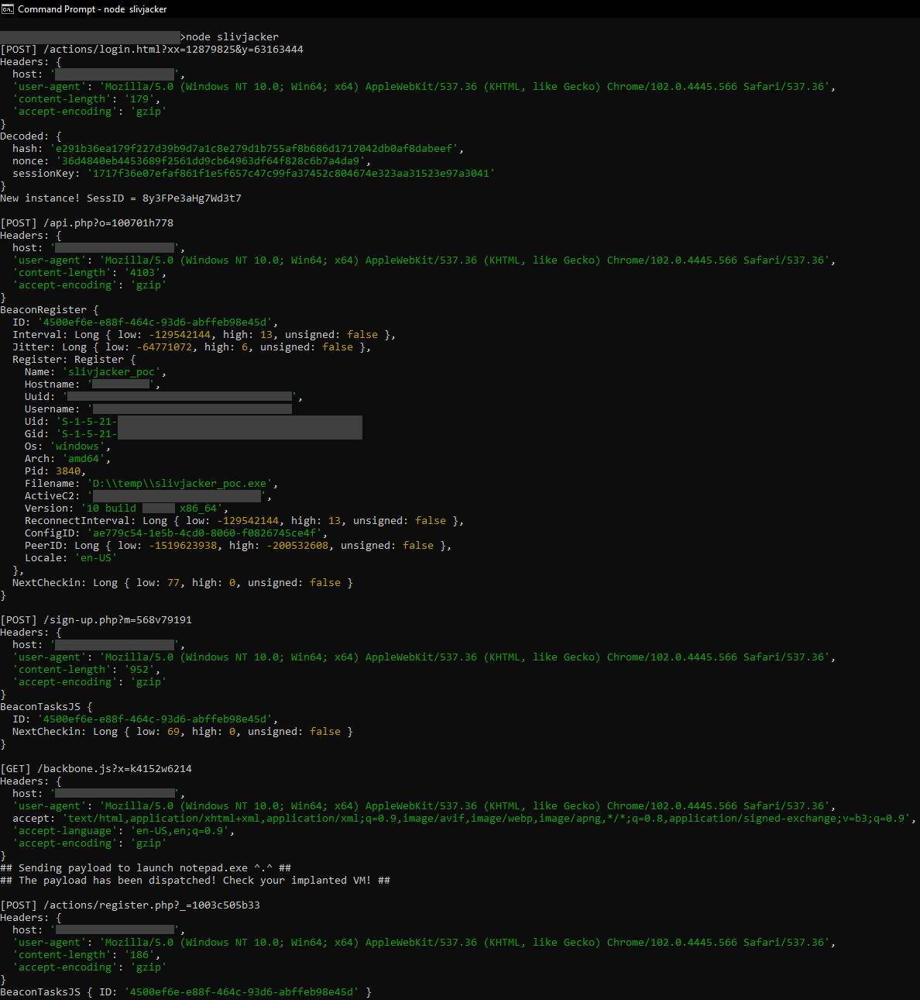

# Slivjacker
### Hijack Sliver Implants Via MitM Attacks
By Tangent65536 at CHT Security Co., Ltd.

---

# Intro
According to the [Sliver documentation](https://github.com/BishopFox/sliver/wiki/Transport-Encryption#known-limitations), the framework is supposed to accomplish (partial) forward secrecy:  

> Perfect Forward Secrecy: We do get some forward secrecy, since only the public key encrypted version of the session key is sent over the wire; therefore **recovery of the hard coded implant keys from the binary should not result in recovery of the session key. Only when the server's private key is compromised can the session key be recovered**, which we currently don't consider to be a problem.  

Nevertheless, the current implementation of the Sliver ECDH key exchange scheme does not provide any extra level of security as a man in the middle with access to a Sliver implant binary listening to the implant's traffic can reliably recover the session key, resulting in full disclosure of all transmitted data. Furthermore, the MitM can fully compromise the connection to execute arbitrary commands supported by the corresponding implant on its installed devices.  

## Expected Behavior
Based on the official documentation, a man in the middle (MitM) without access to the server's private key should not be able to decrypt the underlying data transmission; and any changes made to the data stream should be noticed.  

## Actual Behavior
A MitM with access only to an implant executable can fully compromise the corresponding implant's network traffic, including 1. decrypting and eavesdropping on the underlying data transmission, and 2. taking over the control of the implant to execute arbitrary tasks.

---

# Details

## ECDH Key Exchange 101

*If you don't want to read my poorly written piece of utter nonsense, check out Prof. Mike Pound's awesome video diving into the juicy details here! [Elliptic Curves - Computerphile](https://www.youtube.com/watch?v=NF1pwjL9-DE)* ^.^  

Suppose we have two parties who want to establish a secure communication channel. The abstract idea of the Diffie-Hellman key exchange is that each party generates a pair of public and private keys based on some (publicly) known contexts, and by sending the public component to each other, each party can derive the same shared secret with their own private components and the received public components. The shared secret is then used to deterministically generate a symmetric key used to encrypt transmitted data.  

More technically, using the ECDH as an example, the (misleadingly simplified) mathematic operation performed here is the [elliptic curve point multiplication](https://en.wikipedia.org/wiki/Elliptic_curve_point_multiplication). The operator, which we here simply denote as `**`, takes a point `P` on a given curve `[C]`, and a scalar `n`, to produce another point `Q` on the same curve `[C]`; and we write it as `Q = P ** n`. Please takes it as the definition here that it is always `a point ** a scalar` (you can find more details on the Wikipedia page if you're interested in the underlying math). Also, just remember that while calculating `Q = P ** n` from `P` and `n` is trivial, recovering `n` that satisfies `Q = P ** n` from two given points `P` and `Q` is extremely difficult. (That being said, there are LOTS OF catches. Here, we consider them out of scope. Presumably, one can rely on cryptographic experts to figure out issues within well-maintained public libraries like OpenSSL.)  

The other theorem crucial to understanding this puzzle is that given two integers `m` and `n`, `(P ** m) ** n` equals `(P ** n) ** m`. Furthermore, it's also the same as what `P ** (m * n)` lands on, where `m * n` is the simple integer multiplication you learned in primary school.  

With proper care taken to determine what `m` and `n` are, we can now use them to do the magic tricks we'd like to perform. Suppose that both Alice and Bob agree to use the curve `[C]` and a public base point `G` in the first place. Alice generates a random number `m`, and Bob does something similar independently to get `n`. Now, Alice performs the operation `G ** m` that gives her the point `M = G ** m`; Bob also uses the same point `G` but multiplies it by his number `n` and gets the point `N = G ** n`. Later, Alice and Bob exchange their calculated points `M` and `N` with each other. After that, Alice calculates `N ** m` and Bob computes `M ** n`. Ta-da! Both Alice and Bob get the same point `G ** (m * n)`! This is the point where they reach a shared secret!  

Imagine if another person, Eve, is hiding under the radar and keeping track of everything transmitted between Alice and Bob. Now she can read out both the exchanged points `M` and `N`. Unfortunately for her, since it is difficult to recover either `m` or `n` from those two points, she cannot calculate the shared secret `G ** (m * n)` that Alice and Bob have landed on. This is the core concept of the (EC)DH key exchange scheme, that two parties can establish a shared secret between each other without leaking it to the public.  

## What Exactly Went Wrong?

Unfortunately, things can easily get messed up when extra bits of security are required, such as forward secrecy. By design, the Sliver framework does not satisfy [its definition (from Wikipedia)](https://en.wikipedia.org/wiki/Forward_secrecy):  

> In cryptography, forward secrecy (FS), also known as perfect forward secrecy (PFS), is a feature of specific key-agreement protocols that gives assurances that session keys will not be compromised even if long-term secrets used in the session key exchange are compromised.  

Also on the same Wikipedia page, it reads:  

> For HTTPS, the long-term secret is typically the private key of the server.  

Assuming that all public keys last eternally (as they can be captured by listening to the network traffic), recovery of **any** private key(s) used in the shared secret derivation **will** result in full disclosure of session keys. (And yes, this is how the "[harvest now, decrypt later](https://en.wikipedia.org/wiki/Harvest_now,_decrypt_later)" strategy would work!) As the documentation correctly identifies this as a limitation, we'd argue the recovery of server private keys is not an issue.  

However, the server used the same, hard-coded key pairs from both the server and the implant to derive a shared secret. This is where problems arise.  

During the ECDH key exchange between the implant and the server, the same shared secret can be derived in the following operations:  

> **Option A**: Use the private key from the server (`s`) and the public key from the implant (`C`) to calculate the shared secret `R`. (`R = C ** s`). This is what the server uses.  
> **Option B**: Use the public key from the server (`S`) and the private key from the implant (`c`) to calculate the shared secret `R`. (`R = S ** c`). This is what the implant uses.  

Since both `S` and `c` are statically embedded in the implant, one can recover the shared secret by simply reverse engineering the compiled implant executable. (Basically "replay" what the implant would do to compute the shared secret!)  

Furthermore, as the implant does not validate the authenticity, a MitM who recovered the shared secret (hence granted access to the session key) can produce valid encrypted data streams to control the behavior of the corresponding implant's installations.

## Detailed Walkthrough

As we have already learned that the shared secret can be retrieved simply by extracting the embedded server public key and implant key in the binary, all we have to do now are to spoof as the C2 and to send our own tasks to the hijacked implant. We don't need to worry about all those embedded signature keys either, since the implant relies merely on the session key supposedly only known to the server and itself.  

Below is a brief list of instructions we have to perform:
1. Read the first `POST` request sent from the implant beacon that attempts to perform a key exchange. We simply take the IV in the message and decrypt the session key. Store the key as it will be the master key to the following transfers.  
2. Take the master key and encrypt a random buffer as its "session ID". Send the encrypted and encoded buffer back to the implant.  
3. Ignores the next two `POST` requests. Those two messages contain the installation info which we don't need. However, keep in mind that if these two messages did not show up, it would imply that our reply containing the "session ID" was not recognized by the implant and would have to wait for the next check-in.  
4. The following `GET` request sent from the implant should have the file extension `.js` (indicating it's a poll message looking for tasks to execute). Send our `protobuf` serialized payload back as the reply in this step.  
5. The next `POST` request should contain the execution results. If this message is not received immediately after dispatching the payload, it may mean that our payload is malformed. One would have to wait until the next check-in should this happen.  

## Proof of Concept

The PoC is written in Node.js (`v12.22.12`+) and only works on HTTP(S) implants. The following items/presets are required:  
1. A copy of the implant executable file with its private key and the server's public key retrieved and added to `conf.json`. The corresponding server's private key is NOT needed!  
2. Make sure your implant's C2 points to the PoC server's address to mimic a MitM.  
3. Currently, only the Windows implants with the default config have been tested.  
4. An implant with the version 1.5.x which implements the new ECDH key exchange scheme is required. This PoC does not work with the older 1.4.x protocol.  

By default, the PoC server prints all the received data on the console screen. You should see your designated payload popping up on the implanted device instantly right after the beacon starts.  

Also, if you somehow cannot generate your own implant binary to test on, there's a sample (host: `hxxps://192.168.211[.]129:443`) under the `demo` folder. The default `conf.json` has the settings already filled in targeting this binary. The password is the standard one commonly used in malware analysis.  
